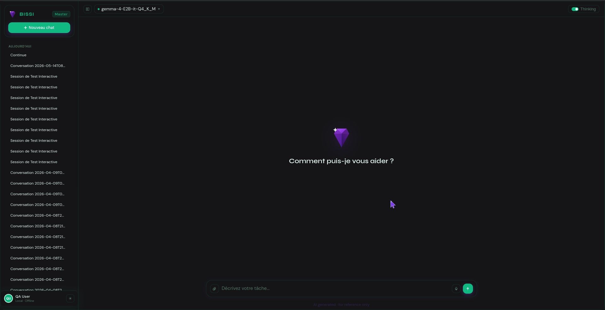
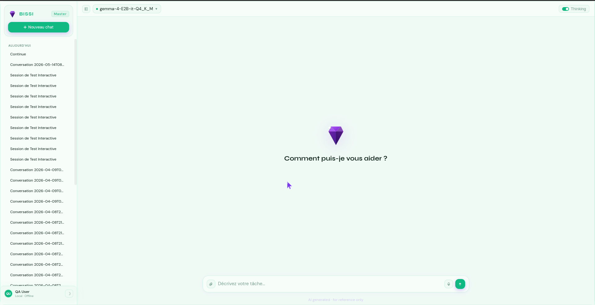

# 🤖 BISSI — Assistant IA local, privé et multimodal

> **Kaggle Hackathon — Gemma 4 Good** | Powered by Google Gemma 4 + llama.cpp

**BISSI** est un assistant IA personnel qui fonctionne **100% sur votre machine**, sans aucune connexion internet. Basé sur **Gemma 4** (Google), il vous aide dans vos tâches quotidiennes tout en garantissant une confidentialité totale.

---

## ✨ Fonctionnalités clés

| Feature | Description |
|---------|-------------|
| 🧠 **IA 100% locale** | Gemma 4 via llama.cpp — aucune donnée ne quitte votre machine |
| 🎤 **Dictée vocale** | Transcription temps réel en français via Web Speech API |
| 📎 **Upload de fichiers** | Glisser-déposer ou coller — le modèle lit et analyse le contenu |
| 🖼️ **Canvas document** | Prévisualisation intégrée : Word, Excel, PDF, code avec coloration syntaxique |
| 🛠️ **Agent avec outils** | Gestion de fichiers, Python, bureautique, recherche, données |
| 💬 **Mémoire persistante** | Historique des conversations en SQLite, chargement instantané |
| 🔍 **Thinking visible** | Le raisonnement interne du modèle affiché en temps réel |

---

## 📸 Aperçu

### Mode sombre


### Mode clair


---

## 🚀 Installation rapide

### Linux / Mac
```bash
curl -fsSL https://raw.githubusercontent.com/Smart-Learn-Squad/bissi/main/install.sh | bash
```

### Windows
```powershell
iwr https://raw.githubusercontent.com/Smart-Learn-Squad/bissi/main/install.bat -OutFile "$env:TEMP\bissi_install.bat"; cmd /c "$env:TEMP\bissi_install.bat"
```

**L'installation automatique inclut :**
- ✅ Dépendances Python et Node.js
- ✅ Téléchargement du modèle Gemma 4 (~3 GB)
- ✅ Configuration de l'environnement
- ✅ Lancement automatique

---

## 🎯 Démarrage

```bash
# Linux/Mac
./start.sh

# Windows
start.bat
```

---

## 🏗️ Architecture

```
bissi/
├── core/
│   ├── agent.py          # Orchestrateur agent + outils
│   ├── engine.py         # Streaming LLM via llama.cpp (OpenAI-compat.)
│   └── memory/
│       └── conversation_store.py  # SQLite — historique persistant
│
├── functions/             # Outils de l'agent
│   ├── filesystem/       # Lecture/écriture fichiers
│   ├── code/             # Exécution Python
│   ├── office/           # Word, Excel, PDF
│   └── data/             # Analyse CSV/données
│
├── api/
│   └── server.py         # FastAPI — SSE streaming + upload fichiers
│
└── bissi-master-ui/       # Electron frontend
    ├── main.js            # Fenêtre + permissions micro
    ├── preload.js         # IPC bridge sécurisé
    └── renderer/
        ├── chat.html      # UI principale (chat + canvas + voix)
        └── onboarding.html
```

**Modèle** : `gemma-4-E2B-it-Q4_K_M.gguf` via `llama-cpp-python`  
**Inférence** : serveur OpenAI-compatible sur `localhost:8001`  
**Backend** : FastAPI sur `localhost:8765` — SSE streaming  
**Frontend** : Electron desktop app

---

## 🛠️ Stack technique

**Backend**
- Python 3.11+ / FastAPI / uvicorn
- llama-cpp-python (Gemma 4 GGUF Q4_K_M)
- SQLite (conversations) / ChromaDB (mémoire vectorielle)

**Frontend**
- Electron (desktop)
- HTML/CSS/JS natifs
- mammoth.js (Word), xlsx.js (Excel), pdf.js (PDF), highlight.js (code)
- Web Speech API (dictée vocale)

---

## 🔧 Développement

```bash
# Backend uniquement
source .venv/bin/activate
uvicorn api.server:app --port 8765 --reload

# Frontend uniquement
cd bissi-master-ui && npm start

# Stack complète
./start.sh
```

### API

```bash
# Santé
curl http://localhost:8765/health

# Chat en streaming (SSE)
curl -N -X POST http://localhost:8765/chat \
  -F "message=Bonjour BISSI" \
  -F "thinking=true"

# Upload de fichier
curl -N -X POST http://localhost:8765/chat \
  -F "message=Analyse ce fichier" \
  -F "files=@rapport.docx"
```

---

## 📚 Documentation équipe

- [AGENTS.md](./AGENTS.md) — Règles de contribution par rôle
- [squad-members.md](./squad-members.md) — Guide contributeurs

---

## 📄 Licence

MIT License — voir [LICENSE](./LICENSE)

---

## 🙏 Remerciements

- **Google** pour Gemma 4 et le hackathon Gemma 4 Good
- **Hugging Face** pour l'hébergement du modèle
- **llama.cpp** pour l'inférence locale ultra-optimisée

---

**BISSI** — L'IA puissante, privée, sur votre machine. 🚀
